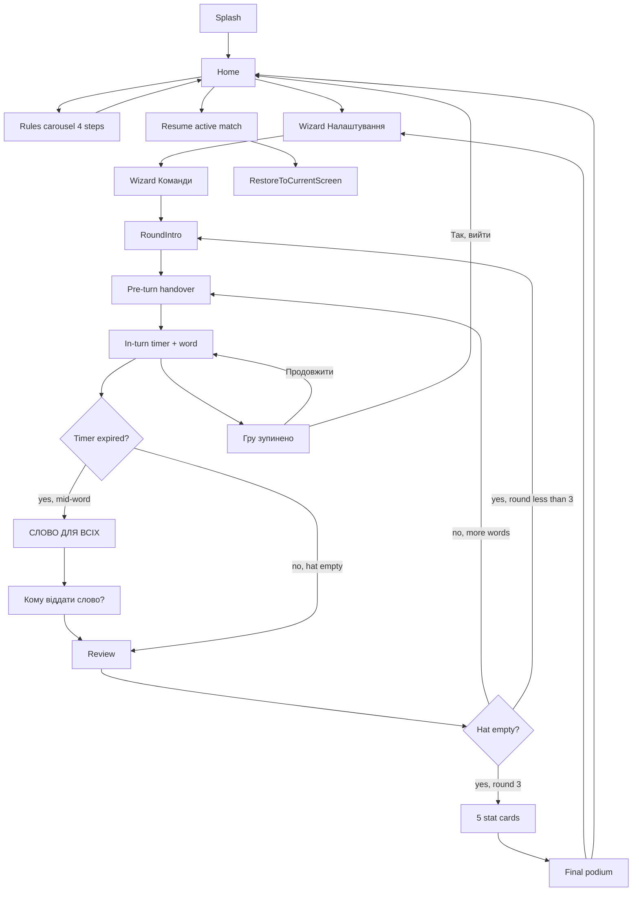

# 1. Executive Summary

**Product direction.** Ship a stable, beautiful, offline, Ukrainian-language **pass-and-play** Hat-Game (Капелюх) for iPhone that is the **bug-free reference implementation** of the classic 3-round Kapelyukh format. Compete on **reliability, taste, and authenticity**, not on novel mechanics. The free V1.0 game is complete and fun in its own right; Pro (V1.1) sells **depth and customization**, never the core loop.

**Key product principles (non-negotiable):**

1. **Offline-first, single device.** No accounts, no backend, no internet required for gameplay.
2. **One device, three classic rounds, one shared word pool.** This is the brand. Same words explained, mimed, then one-worded — the escalating familiarity is the dopamine.
3. **The base game is complete.** No "demo" feeling. No paywalls on rounds, teams, difficulty, or core dictionary.
4. **No ads. Ever.** In any version.
5. **Reliability over flash.** A timer that never drifts, autosave after every event, a session that survives a phone call or lock — beats fancy animations.
6. **Ukrainian-only, permanently.** No i18n layer, no localization framework, no translation keys. Every user-facing string is a Ukrainian string literal in the codebase. The product *is* a Ukrainian-language game; multi-language support is explicitly out of scope forever (or at minimum, would be a future fork, not a feature flag).
7. **Pure domain engine.** Game logic is React-free, side-effect-free, and unit-tested independently. UI is a thin reactive shell over it.
8. **Solo-team friendly architecture.** Boring, well-supported libraries; no exotica.

**Recommended tech stack (locked).**

- **Runtime:** React Native + Expo (managed workflow + Development Build via EAS), TypeScript `strict: true`.
- **Routing:** `expo-router` v7 (file-based).
- **State:** `zustand` 5.x with slices, MMKV persistence middleware.
- **Persistence:** `react-native-mmkv` for active match + settings (fast, sync, perfect for KV); `expo-sqlite` for the word dictionary + session history (queryable, scales for V1.1 custom packs).
- **Secure state:** `expo-secure-store` (reserved — used in V1.1 for Pro entitlement cache).
- **UI / animation:** `nativewind` v4 (Tailwind), `react-native-reanimated` v3, `react-native-gesture-handler`, `expo-haptics`, `expo-audio` (the `expo-av` successor), `expo-keep-awake`.
- **Localization:** **None.** No `i18next`, no `expo-localization`, no `react-i18next`, no JSON locale files. Ukrainian string literals live directly in components. Date/number formatting uses `Intl` with hardcoded `'uk-UA'`. (Saves a dependency, a provider, and an entire layer of indirection.)
- **Observability:** `@sentry/react-native` from day 1 (crashes only, no PII). Product analytics deferred to V1.1.
- **Build / release:** EAS Build, EAS Submit, EAS Update for OTA JS-only fixes.
- **Testing:** Jest + React Native Testing Library for domain/units; Maestro for one happy-path E2E.
- **IAP (V1.1 only):** `expo-iap` v3+ (StoreKit 2, no third-party dependency). RevenueCat explicitly rejected for V1.0/V1.1 — overkill for one non-consumable.

**MVP philosophy:** **"Boringly excellent core loop, zero IAP, Ukrainian-only, one platform."** Everything that doesn't pass through the timer in the first 60 seconds of play is post-MVP.

---

# 2. Technical Specification Analysis

## 2.1 `TZ_Kapelyukh.md` (~1,317 lines, UA, full PRD)

- **Strengths:** Most product-complete spec; deep monetization ethics ("чесна безкоштовна версія"); authentic 3-round loop with post-turn dispute toggles; domain-first FSM with test plan; thoughtful offline resilience (timer pause, low-battery warning, call interrupt); honest stack comparison.
- **Weaknesses:** Massive MVP scope creep — §22 acceptance criteria require **Pro custom words + premium themes + extended dictionary + special modes** at launch in 8–12 dev weeks. 2,000 curated UA words is barely budgeted. Unrealistic D7 retention target (25–35%). Special modes (Дуелі, Мікс, Все навпаки) multiply test matrix.
- **Keep:** Post-turn «Зараховано / Скасовано» toggle; same word bank across all 3 rounds; word repeat exclusion via last-3-matches history; absolute-time timer with foreground/background handling; lifetime + cosmetic Pro tier philosophy.
- **Reject / postpone:** Pro special modes; «Домашні правила»; sound packs and 5–8 premium themes; remote dictionary OTA; subscriptions; Detox + Maestro overlap; 70% coverage target.

## 2.2 `compass_artifact_*.md` (~900 lines, UA, App Store–literate)

- **Strengths:** Most App Store– and IAP-literate spec — Privacy Manifest, AI disclosure, 24.8% rejection-rate awareness, UGC argument for custom words ("local Notes-like data"), sandbox IAP plan. Correctly proposes **V1.0 without Pro, V1.1 adds IAP** — this is the right call.
- **Weaknesses:** Over-specified polish for MVP (full haptic matrix, 5 sound effects, swipe physics + `rn-swiper-list`). Pins SDK 55 / RN 0.83 to May 2026 — already ageing. Open-ended "bundle all future packs" obligation. 900-word minimum has no content-creation pipeline.
- **Keep:** V1.0-without-Pro release strategy; **lifetime-only IAP at $4.99** (no subscriptions); interim screen with long-press dispute; swipe + buttons (never swipe-only); reviewer-notes framing for custom words; MMKV recommendation; portrait-only iPhone.
- **Reject / postpone:** Drawing mode with `react-native-skia` (V1.2); CloudKit sync; bundle SKU; 18+ pack at launch (App Store risk); `rn-swiper-list` as a dependency for a single card.

## 2.3 `gpt-1.md` (~1,200 lines, UA, advisor tone)

- **Strengths:** Most implementation-ready of the GPT specs — strong on edge cases, undo/edit results, "Turn Ready" anti-spoiler screen, skip-returns-to-queue rule, offline entitlement cache rationale. Clear data models. Practical separation of `gameEngine` service.
- **Weaknesses:** **Internal contradictions** — Pro in V1.0 (§30) vs deferred to V1.1 (§7); one theme vs custom Pro themes; round-end semantics unclear with 6 teams × 90 words. AI word generator and stats underspecified. Detox + RevenueCat + RNTL + Sentry — too many V1 vendor decisions.
- **Keep:** **"Turn Ready" handover screen** (anti-spoiler); same deck reshuffled per round; **edit turn results on summary**; skip → word returns to queue (MVP default); "Quick game / repeat last settings" CTA; explicit "stable Капелюх without bugs" positioning.
- **Reject / postpone:** AI generator; subscription; à-la-carte pack sprawl; 4th round / custom round order; Detox; multi-vendor analytics decision; design-system "монстр."

## 2.4 `gpt-2.md` (~160 lines, UA, consultant/analyst)

- **Strengths:** Market-grounded — names real competitor failures (Hat Up, Monikers, Words In Hat) and targets them. **Timestamp timer + autosave-on-every-action** directly addresses competitor bugs. Best **SQLite schema** of all five specs (`packs`, `categories`, `words`, `sessions`, `session_words`, `teams`, `turns`, `entitlements`). Sharp Definition-of-Done ("no negative timer, kill-restore works, no duplicate scoring").
- **Weaknesses:** No state-management library named. 6 sprints optimistic for IAP + a11y + dual locale. QR pack sharing underspecified. Heavy LLM-citation noise. iPad mentioned without layout.
- **Keep:** **SQLite schema** as canonical persistence (adopt nearly verbatim, drop `entitlements` for V1.0); **`session_words` table with per-round states**; **turn review/correction as core MVP UX**; **timestamp timer** (`turn_end_at`); **button-only input** (swipes dropped per §7.4 decision); **Definition of Done** checklist for shipping.
- **Reject / postpone:** Public pack catalog; subscription "Pack Club"; QR sharing as MVP feature; iPad layout work.

## 2.5 `gpt-3.md` (~90 lines, EN, strategic brief)

- **Strengths:** Clearest strategic positioning — "digital hat, not a headband game"; resume-game as first-class CTA; **explicitly rejects NLP rule enforcement** (rules are social, not technical); strongest App Store / compliance hygiene; **Custom Packs Studio** framing for V1.1 Pro.
- **Weaknesses:** No folder structure, no TS schemas, no navigation map — strategy doc, not engineering spec. Entities described in prose only. LLM citation markup throughout.
- **Keep:** **Resume-Game as primary CTA** on Home when an unfinished session exists; **TurnEvent immutable log** (excellent for autosave, replay, undo); **manual score correction post-turn**; **preset-driven setup**; reduced motion in accessibility; Pro = depth/customization framing.
- **Reject / postpone:** Forehead/tilt play (not the product); semantic rule enforcement; brand/celebrity packs; canary RN builds; analytics on raw custom-word text.

---

# 3. Unified Product Vision

**Final concept.** "Капелюх" — a **premium-feeling, offline, single-device Ukrainian party game** that delivers the classic three-round Kapelyukh experience (**Еліас → Крокодил → Асоціація** on a single shared word pool) with zero friction: open app, tap «Нова гра», play in 10 seconds. Compete on **taste and reliability**, not feature count.

**Target audience.**

- **Primary:** Ukrainian-speaking adults 18–40, gathering 4–10 people at home, dinner parties, weekends. Smartphone-native, value taste, allergic to ads and subscriptions in casual games.
- **Secondary:** Ukrainian diaspora abroad nostalgic for the offline party-game tradition.
- **Tertiary (V1.x+):** Family play (10+), birthday parties, corporate teambuilding. **No non-Ukrainian audiences are in scope** — the product is intentionally narrow.

**Core gameplay loop** (mockup-accurate, see `mockups/` for visual reference):

1. **Splash** (logo bucket-hat with UA-flag heart) → **Home** with 3 CTAs: **Теми** (Pro paywall, V1.1 only — hidden in V1.0), **Нова гра**, **Правила**.
2. **Правила** is a 4-step carousel, fully skippable via "Все зрозуміло":
   - Step 1 «Про що ця гра?» — concept primer with «УВАГА» tip card.
   - Step 2 «Як пояснювати?» — three rounds explained: **ЕЛІАС** (words), **КРОКОДИЛ** (gestures), **АСОЦІАЦІЯ** (one word). «ПОРАДА» tip.
   - Step 3 «Хто перемагає?» — scoring rules, including **−1 for skip** and the "last word for everyone" mechanic.
   - Step 4 «Підготовка до гри» — pre-game checklist (gather friends, split into ≥2 teams of ≥2, choose settings). CTA: «Хочу грати!».
3. **Налаштування** (wizard, single screen, sectioned horizontal pickers): word count (30/45/60/75/90), round duration in seconds (60/90/120), team count (2–N), difficulty (Легкий/Середній/Важкий), skip-penalty radio (see §6.3). CTA: «Далі».
4. **Команди**: list of teams pre-filled with randomly generated Ukrainian-language placeholder names (e.g. «Команда 1», «Команда 2», or short fun two-word combos of Ukrainian adjectives + nouns from a curated internal list — **not** copied from any existing app). Tap to rename. CTA: «Далі».
5. **Round intro** (Тур 1/2/3, big round name on full-bleed colored card, **ЗАБОРОНЕНО** list of red-cross constraints, home-icon top-left, «Далі»). Each round has a distinct color identity (R1 pink+yellow, R2 teal+pink, R3 lime+pink).
6. **Pre-turn handover**: «Команда готується до гри» + team name large + «Поїхали!» button. Anti-spoiler — explainer hands phone, taps to start.
7. **In-turn**: team name top, large word card with round color, circular ring timer + numeric MM:SS center, **pause icon** below timer, live counters of current-turn skips (under × button, left) and guesses (under ✓ button, right), two big circular action buttons × (Пропустити) and ✓ (Вгадав). Home icon top-left is a quick-exit that triggers a pause modal («Гру зупинено — Так, вийти / Продовжити»).
8. **Timer expiry mid-word** → **«СЛОВО ДЛЯ ВСІХ»** screen: the current word stays visible, timer reads 00:00, all teams can race to guess. After resolution, a modal **«Кому віддати слово?»** lists every team plus «Ніхто не вгадав»; one selection awards the word (+1 to that team) or marks it skipped.
9. **Turn review**: banner is either **«Капелюх пустий»** (all words guessed → round over) or **«Час вичерпано»** (turn timer expired → next team continues the round). Shows team name + «Нараховано балів» with the net score and an info-tap explaining the −2 penalty for toggling a guessed word back to not-guessed. List of every word this team faced, each with a checkbox — untick to dispute. CTA: **«Наступна команда»** (hat not yet empty) or **«Наступний тур»** (hat empty, more rounds) or **«Результати гри»** (hat empty, final round).
10. **Next round** repeats steps 5–9 on the **same word set, reshuffled**, with the next round's color identity.
11. **End-of-match highlights screen**: a short screen shown before the podium that surfaces 2–3 fun facts computed from the match's `TurnEvent` log. The exact copy and framing are our own design (not copied from any reference app). Examples: the word that took the most total turns across all three rounds to finally be guessed; the team that scored the most points in a single turn; the round in which the most words were guessed overall. Tapping «Далі» advances to the podium. The screen is **skippable** (secondary link «Пропустити»). Exact card count and copy TBD by designer in Phase 4.
12. **Final podium** «Гру завершено / Вітаємо команди!»: medal + winner with total score, then a table — header row «Тур | I | II | III | 🏅», one row per team with per-round and total scores. Confetti animation. CTA: **«Зіграти ще!»** (return to wizard pre-populated with same teams/settings).

**Critical rule clarifications baked into the mockups:**
- A **round ends only when the hat is empty** ("Капелюх пустий"). The per-turn timer ends the turn, not the round.
- **Skip = −1 point** (encourages commitment).
- **Toggling a guessed word back to "not guessed" in review = −2** (removes the +1 award and adds the −1 skip penalty in one tap).
- **Skipped words return to the queue** for the next team within the same round; they only leave the queue when guessed or "awarded" via «СЛОВО ДЛЯ ВСІХ».
- A **time-up "Слово для всіх"** word can be awarded to any team (not just the current one) or marked as not-guessed; it counts as +1 (or 0) for that team and removes the word from the round queue.

**Final monetization strategy.**

- **V1.0:** Free. No IAP. No ads. No accounts. (Validate retention; reduce App Store review surface.)
- **V1.1 (~6 weeks after V1.0 ships):** Single one-time IAP — **"Капелюх Pro"** at ~$4.99 (149₴) — unlocks **Custom Packs Studio** (private user-created word packs, edit, import/export `.json` via Files app share sheet) + 2–3 hand-curated thematic packs + custom app theme + extended session stats.
- **V1.2+:** Additional thematic packs as $0.99 non-consumables, never bundled into long-term obligations.
- **Forever:** No subscriptions, no ads, no Pro paywalls on free-tier core gameplay.

**Long-term vision (12–24 months, contingent on V1.0 retention).** Note: **no localization roadmap.** The app stays Ukrainian-only across all listed versions.

- **V1.2:** iPad layout (already portrait, mostly free).
- **V1.3:** Android via EAS multi-platform (validate parity, still Ukrainian-only).
- **V2.0:** Optional **"Share screen" mode** — host's phone is the source of truth, other phones join via local QR/Bonjour for personal word display (still no backend). Genuine online multiplayer rejected — wrong product.

---

# 4. Final Recommended Architecture

## 4.1 Frontend architecture

**Layered, dependency-inverted:**

```
┌──────────────────────────────────────────────────────────┐
│  app/             Expo Router screens (presentation only) │
├──────────────────────────────────────────────────────────┤
│  features/        Feature slices (game, home, settings)   │
│                   Connect screens ↔ stores ↔ domain       │
├──────────────────────────────────────────────────────────┤
│  domain/          PURE TS — game engine, FSM, rules       │
│                   No React, no Expo, no I/O                │
├──────────────────────────────────────────────────────────┤
│  infrastructure/  storage, db, audio, haptics, analytics   │
└──────────────────────────────────────────────────────────┘
```

Strict rule (enforced by ESLint `no-restricted-imports`): `**domain/` may not import from `app/`, `features/`, or `infrastructure/`.**

## 4.2 Folder structure (see §10 for full tree)

`src/{app,features,domain,infrastructure,ui,shared,content}` with `app/` as the Expo Router root. **No `locales/` folder** — Ukrainian strings live inline in components or in `src/content/strings.ts` when reused across screens.

## 4.3 State management

**Zustand** with three slices, each in its own file:

- `gameStore` — active match snapshot (mirrors `domain/GameState` 1:1), MMKV-persisted under key `kapelyukh.activeMatch`.
- `settingsStore` — sound, haptics, theme, analytics opt-out. MMKV-persisted.
- `historyStore` — last 20 finished matches summary. SQLite-backed via thin selector.

**No Redux. No Recoil. No context-as-state.** Zustand is enough; do not introduce a second state library.

## 4.4 Storage strategy


| Concern                   | Tech                                                                         | Rationale                                                      |
| ------------------------- | ---------------------------------------------------------------------------- | -------------------------------------------------------------- |
| Word dictionary           | `expo-sqlite` (bundled `kapelyukh.db` asset, copied to docs on first launch) | Queryable by difficulty/category; scales for V1.1 custom packs |
| Session history (last 20) | `expo-sqlite`                                                                | Same DB; one `sessions` table                                  |
| Active match snapshot     | `react-native-mmkv` key `kapelyukh.activeMatch`                              | Fast sync writes after every event; survives kill              |
| App settings              | `react-native-mmkv` key `kapelyukh.settings`                                 | Sync read on boot                                              |
| Pro entitlement (V1.1)    | `expo-secure-store`                                                          | Tamper-resistant cache                                         |


**Dual storage justified** — SQLite for relational/queryable data, MMKV for hot KV. Do not put the active match in SQLite (write churn on every guess/skip is wasteful).

## 4.5 Navigation

`**expo-router` v7**, file-based, single stack:

```
app/
├── _layout.tsx          Root stack + theme provider (no i18n provider — UA-only)
├── index.tsx            Home
├── rules.tsx            How to play
├── settings.tsx         Settings
├── about.tsx            About / credits
└── game/
    ├── _layout.tsx      Game group; disables back-swipe in-turn
    ├── setup.tsx        Single-screen wizard
    ├── round-intro.tsx  Round number/type intro
    ├── pre-turn.tsx     "Pass the phone to <Team>" + Start
    ├── turn.tsx         The active turn (timer, word card)
    ├── review.tsx       Post-turn correction
    ├── round-results.tsx
    └── results.tsx      Final podium
```

Deep-linking deferred to V1.1.

## 4.6 Game engine separation

`domain/game/` is **the heart of the product** and is built first.

- `GameState` — discriminated union over `status: 'idle' | 'setup_settings' | 'setup_teams' | 'round_intro' | 'pre_turn' | 'in_turn' | 'awaiting_award' | 'review' | 'round_results' | 'stat_carousel' | 'end_of_match'` (see §8 for the full list and additional events for «Слово для всіх» and the stat carousel).
- `gameReducer(state, event): GameState` — pure function, no side effects, no `Date.now()` calls inside. Time is **always passed in** via the event payload.
- `events.ts` — see §8 for the full `GameEvent` union (includes `AWARD_WORD`, stat-carousel events, replay-with-same-teams).
- `selectors.ts` — `selectCurrentTeam`, `selectRemainingWords`, `selectScoreboard`, `selectMatchStats` (powers the 5 stat-carousel cards), `selectIsHatEmpty`.
- `wordSelector.ts` — Fisher-Yates shuffle over filtered pool, excluding word IDs seen in the last 3 finished sessions (queried from SQLite).
- `scoring.ts` — `applyReviewOverrides(turnEvents, overrides): TeamScoreDelta` and the `SCORE` constants table.
- `__tests__/` — exhaustive Jest tests; target **90%+ coverage on `domain/`** (lower elsewhere is fine). Must include named tests for: timer-expiry-mid-word → award flow; skip-FIFO recycling; review-toggle ±2 symmetry; hat-empty round transition; stat selectors.

**UI never calls `gameReducer` directly** — `features/game/useGame.ts` is the only call site, wrapped in Zustand actions that persist after every transition.

## 4.7 Purchase system (V1.1 — out of MVP, but architected for)

Single non-consumable product `com.kapelyukh.pro.lifetime`. `infrastructure/purchases/` exposes `getEntitlement(): Promise<ProEntitlement>` and `purchasePro()`. `useEntitlement()` hook reads cached value from secure-store on boot and re-validates lazily. V1.0 ships with a **stub returning `{ isPro: false }`** so call sites can be written safely now.

## 4.8 Analytics

**V1.0:** Sentry crashes only. Zero product analytics. (Reduces App Privacy Manifest surface to "Crash Data, not linked to identity".)
**V1.1:** Optional PostHog with explicit opt-in toggle in Settings, defaulting **off**. Event taxonomy: `game_started`, `round_completed`, `match_completed`, `pro_paywall_shown`, `pro_purchased`. Never log word text.

## 4.9 Testing strategy


| Layer           | Tool        | Target coverage | What to test                                        |
| --------------- | ----------- | --------------- | --------------------------------------------------- |
| `domain/`       | Jest        | **90%+**        | FSM transitions, word selector, scoring, edge cases |
| Selectors/hooks | Jest + RNTL | 60%             | Store actions, hook outputs                         |
| Components      | RNTL        | smoke only      | Renders + key interactions                          |
| E2E             | Maestro     | 1 happy path    | Home → setup → finish round 1                       |


**Do not adopt Detox.** Maestro is enough for one E2E. Manual TestFlight passes catch the rest.

---

# 5. MVP Scope (V1.0)

## 5.1 Must-have (V1.0 ships only when ALL of these work)

- Three-round game loop **ЕЛІАС → КРОКОДИЛ → АСОЦІАЦІЯ** on a single shared word pool, with the round ending only when the hat is empty
- 2–N teams (recommend cap N=8) with randomly-generated original UA placeholder names + tap-to-rename
- Configurable: word count {30/45/60/75/90}, round duration {60/90/120}s, team count, difficulty multi-select {Легкий/Середній/Важкий}, skip-penalty radio (−1 / 0)
- **~100 curated Ukrainian words** for V1.0 launch (sufficient to validate the loop); word list grows in post-launch updates
- Pure-function `gameReducer` with full Jest coverage of FSM, including `awaiting_award` and the `±2` review toggle
- Absolute-time timer with `AppState` pause/resume; no drift on background
- **«СЛОВО ДЛЯ ВСІХ»** mechanic: on per-turn timer expiry mid-word, the word card persists and the «Кому віддати слово?» modal awards the word (+1 to any team) or marks «Ніхто не вгадав»
- Autosave after **every** event; resume on cold start with explicit "Продовжити гру?" prompt
- 4-step **Rules carousel** with skip-friendly «Все зрозуміло»
- 2-step setup wizard (Налаштування → Команди) with snap-scroll horizontal pickers
- Turn-review screen with live score recompute on checkbox toggle, info-modal explaining the −2 penalty
- Per-round color identity (R1 pink+yellow, R2 teal+pink, R3 lime+pink) with smooth between-round cross-fade
- Home icon (🏠) during gameplay opens pause modal «Гру зупинено — Так, вийти / Продовжити»
- 5-card **stat carousel** before the final podium with the «Легко / Важко / Вражаюче / Що це / Потужно» selectors
- Final podium with medal + per-round × per-team scoreboard table + confetti + «Зіграти ще!»
- Haptics: light on ✓ guess, warning on × skip, heavy at 10s / 3s / 0s
- Sounds: optional, 3 SFX max (guess, skip, time-up); system-silent-switch respected
- Keep-awake during turn
- VoiceOver labels on every interactive element; Dynamic Type up to XL
- Dark mode following system (note: round colors are vivid and override theme on game screens)
- Portrait-only iPhone; iOS 16+ (covers >97% as of 2026)
- Sentry crash reporting
- Privacy Policy + Terms hosted on a simple static page (UA only)

## 5.2 Should-have (ship if time allows in V1.0; otherwise V1.0.1 patch)

- Confetti animation on final winner
- "Sudden death" tie-break round (1 word, both teams; faster wins)

## 5.3 Postponed (V1.1 — first feature release ~6 weeks after V1.0)

- **Капелюх Pro** ($4.99 lifetime, single product):
  - **Custom Packs Studio** (create/edit/delete private packs, mix into rounds)
  - Pack import/export via Files share sheet (`.kpack.json` schema)
  - 2–3 hand-curated thematic packs ("Кіно та серіали", "90-ті", "Меми")
  - Extended match stats (per-team-per-round, best/worst word)
  - 2 custom themes
- Optional PostHog analytics (opt-in)

## 5.4 Never in MVP (firm "no")

- Accounts, login, cloud sync, social
- Online multiplayer / room codes
- Public UGC pack catalog
- Subscriptions of any kind
- Ads, interstitials, rewarded video
- 18+ pack (App Store review hazard pre-V1.1 with no review surface)
- Drawing/Skia mode
- Forehead/tilt-to-score (wrong product)
- NLP rule enforcement (translations, cognates) — rules are social
- AI-generated word packs
- Android / iPad (V1.3+ / V1.2)
- 4th round / custom round-order / custom round types
- Pro special modes (Дуелі, Все навпаки, Мікс, Домашні правила)
- Premium sound packs
- Remote dictionary OTA (EAS Update of bundled JS is enough)
- Detox e2e
- RevenueCat (overkill for one product; revisit at 3+ SKUs)
- **Any non-Ukrainian language support** — no English, no Russian, no Polish, ever. Not even as a feature flag, not even with the i18n scaffolding "for later." The entire product, App Store listing, marketing site, and customer support are Ukrainian-only.
- `**i18next`, `expo-localization`, `react-i18next`, locale files, or any translation library.** All forbidden dependencies.

---

# 6. Game Logic Plan

## 6.1 Rounds

Three sequential, fixed order on **one shared word set**. Names and constraints are mockup-canonical (see `mockups/IMG_9135`, `IMG_9149`, `IMG_9155`):

1. **Тур 1 — ЕЛІАС.** Speaker explains the word with words only (Alias-style).
   ЗАБОРОНЕНО: жести та міміка, однокореневі слова, переклад іноземною.
   Color identity: **pink + yellow accents**.
2. **Тур 2 — КРОКОДИЛ.** Same words, pantomime only.
   ЗАБОРОНЕНО: вимовляти слова та будь-які звуки, вказувати на людей та предмети, використовувати предмети.
   Color identity: **teal + pink card**.
3. **Тур 3 — АСОЦІАЦІЯ.** Same words, one word association only.
   ЗАБОРОНЕНО: використовувати однокореневі слова, використовувати міміку та жести, говорити більше одного слова.
   Color identity: **lime/yellow + pink card**.

Rules are **social, not enforced** by the app — there is no NLP validation. The constraint lists are shown to set table expectations.

Each round uses the **same `sessionWords` list** of N unique IDs. At the start of rounds 2 and 3 the list is reshuffled (Fisher-Yates over remaining word IDs of the round, which is the full set since rounds reset). The `domain/game.ts` reducer creates a fresh `RoundState` with `remainingWordIds = [...originalSessionWordIds]` for each new round.

**A round ends ONLY when the hat is empty** — i.e. all `sessionWords` have been guessed or awarded via «Слово для всіх». The per-turn timer never ends a round; it ends the current turn, after which the next team continues drawing from the remaining word pool.

## 6.2 Timer logic

**Absolute time only.** When a turn starts:

```
turnStartedAt = Date.now()
turnEndsAt    = turnStartedAt + settings.turnDurationMs
```

Remaining ms = `Math.max(0, turnEndsAt - Date.now())`. `setInterval(100ms)` only drives **rendering**, never state. On `AppState.change` → `background`:

```
pausedAt = Date.now()
remainingAtPause = turnEndsAt - pausedAt
```

On resume: `turnEndsAt = Date.now() + remainingAtPause`. Show "Гру призупинено — продовжити?" modal — user taps to resume.

Edge cases: incoming call, lock screen, low-battery alert, notification → all trigger pause via `AppState`. Negative remaining is impossible by construction.

## 6.3 Scoring

Scoring rules (mockup-informed, with our own adaptations):

- **`+1` per guessed word.**
- **Skip penalty** is **configurable** via a radio button in the setup wizard (§7.1 screen 4). Two options:
  - **«Без штрафу»** — skip scores `0`; skipped word returns to the round queue.
  - **«Штраф за пропуск: −1»** — skip scores `−1`; skipped word still returns to the queue.
  - Default: **«Без штрафу»** (friendlier for first-time players). This is stored in `MatchSettings.skipPenalty: 0 | -1`.
- **`+1` per «Слово для всіх» awarded** to a team via the post-timer modal. Word leaves the round queue regardless of outcome.
- **`0`** if «Слово для всіх» is resolved as «Ніхто не вгадав». Word leaves the round queue.
- **Review-screen toggle semantics:**
  - Uncheck a guessed word → remove `+1` and apply the current skip penalty (0 or −1). Net delta: `−1` or `−2` depending on `skipPenalty`.
  - Re-check a skipped/unchecked word → reverse the above delta.
- **Minimum score per team is 0.** A team's total score is clamped to `Math.max(0, computed)` at every display and storage point. Scores can go negative mid-turn during computation, but are clamped before writing to state.
- **Per-team per-round subtotal** stored in `Team.scores[RoundType]`; total = sum of clamped per-round values (each clamped independently to ≥ 0).
- **Ties:** V1.0 displays multiple medals (co-winners). Sudden-death is should-have.

These rules live entirely in `domain/game/reducer.ts` and `domain/game/scoring.ts`; all UI score displays read derived selectors.

## 6.4 Word generation & flow within a round

**Match-level word selection** (runs once, at `SETUP_COMPLETED`):

```
1. Query SQLite: SELECT id FROM words WHERE difficulty IN (?) ORDER BY RANDOM() LIMIT N*3
2. Exclude word IDs present in the last 3 finished sessions (queried from sessions table)
3. If pool < N, refill from full dictionary (relaxing the difficulty filter as last resort)
4. Fisher-Yates shuffle, take first N
5. Persist as sessionWordIds in MMKV active-match — this is the round-1 / round-2 / round-3 source pool
```

Difficulty is **proportional** when multi-selected: if user picks Легкий+Важкий, sample 50/50 from each tag.

**Round-level queue** (managed by reducer, no SQLite hit):
- At round start, `RoundState.remainingWordIds = [...originalSessionWordIds]` (reshuffled with Fisher-Yates each round).
- On `START_TURN`, the reducer pops the head of `remainingWordIds` into `TurnState.currentWordId`.
- On `GUESS_WORD`: word is added to `RoundState.guessedWordIds` and removed from the queue; next word popped into `currentWordId`.
- On `SKIP_WORD`: word is **pushed to the tail** of `remainingWordIds` (FIFO recycling), then next word popped.
- On `TIMER_EXPIRED`: turn enters the `awaiting_award` sub-state with `currentWordId` still showing; reducer waits for `AWARD_WORD` event.
- On `AWARD_WORD`: the word is removed from the queue, the awarded team's score is incremented (or 0 if «Ніхто не вгадав»), then `TurnState` is finalized and turn enters review.
- The round ends (transition to `round_results`) when `remainingWordIds.length === 0` AND `currentWordId === null`.

## 6.5 Persistence

- After **every** `gameReducer` transition, the new state is written synchronously to MMKV (`kapelyukh.activeMatch`).
- On cold start: if `activeMatch` exists and `status !== 'end_of_match'`, Home shows **"Продовжити гру" as primary CTA** above "Нова гра" (idea from gpt-3).
- On `end_of_match` transition: snapshot is written to SQLite `sessions` table, then MMKV key cleared.
- TurnEvent log (`TurnEvent[]`) is kept in the active-match blob (last turn only, for review screen) and dropped on `NEXT_TURN`.

## 6.6 Edge cases


| Case | Behavior |
|---|---|
| User taps «Вгадав» 5× rapidly | Each tap consumes one word; turn ends only when the **per-turn timer expires** OR the **hat is empty** |
| Per-turn timer expires mid-word | Current word becomes «СЛОВО ДЛЯ ВСІХ»; modal awards the word (+1) to a team or marks «Ніхто не вгадав» (0); then turn ends and review screen appears |
| Hat goes empty mid-turn | Turn ends immediately; review banner reads «Капелюх пустий»; CTA «Наступний тур» (R1/R2) or «Результати гри» (R3) |
| Per-turn timer expires with no current word (deck briefly empty between renders) | Impossible by construction — the next word ID is selected synchronously with the previous-word resolution |
| User force-quits during turn | Active-match restored on next launch; resume modal shown |
| Phone dies | Same as force-quit |
| Skip queue grows large | Word selector pops from FIFO head; the round simply continues across more turns until skipped words are eventually guessed |
| All teams have 0 score at end | Allowed; podium shows 0 for all teams |
| A team's computed score goes below 0 | Clamped to 0 before storing and displaying; minimum visible score is always 0 |
| Single team selected (degenerate) | Setup wizard requires ≥2 teams; «Далі» disabled otherwise |
| User changes settings mid-match | App-level settings (sound/haptics/theme) apply immediately; match settings (timer, word count, difficulty) are immutable for the active match |
| Word repeats within a round | Impossible — guard in word selector + assert in reducer |
| Word from R1 reappears in R2/R3 | **Required** — `sessionWordIds` are intentionally reused across rounds; this is the product's brand mechanic |
| User taps × on a stat card | Card dismisses; carousel advances; final dismiss reveals podium |
| User taps home icon (🏠) during gameplay | Triggers pause modal «Гру зупинено»; options «Так, вийти» (clears active-match, returns to Home) / «Продовжити» (resume turn with timer adjusted for pause duration) |
| User toggles the same word multiple times in review | Score delta is recomputed from the final checkbox state vs. the original turn outcome; no cumulative drift |


## 6.7 Offline behavior

The app **never** hits the network for gameplay. The only network calls in V1.0:

- Sentry (crashes only, batched, can be disabled in Settings)
- EAS Update check at boot (`expo-updates`, JS-only, silent)

No network, no degradation.

---

# 7. UX / UI Plan

## 7.1 Screens


Mockup-canonical (see `mockups/IMG_91xx.PNG`). V1.0 inventory; «Теми» (paywall) is V1.1 only.

| # | Screen | Mockup ref | Purpose | Key elements |
|---|---|---|---|---|
| 1 | **Splash** | 9124 | App boot | Bucket-hat logo with UA-flag heart, brief fade-out to Home |
| 2 | **Home** | 9125 | Entry | Logo + «КАПЕЛЮХ» wordmark, 3 stacked pill buttons. V1.0: «Нова гра» + «Правила» (Теми hidden). If an active match exists, a top «Продовжити» pill is added per §6.5 |
| 3 | **Rules carousel** | 9127–9130 | Onboarding (skippable) | 4 horizontally-paged screens: «Про що ця гра?», «Як пояснювати?», «Хто перемагає?», «Підготовка до гри». Each has body copy, an emphasis card (УВАГА / ПОРАДА), primary CTA advancing to the next step, secondary «Все зрозуміло» link to exit to Home |
| 4 | **Wizard — Налаштування** | 9131, 9133 | Match settings | Header «Налаштування» + back arrow. Four horizontal snap-scroll pickers (centered = current, neighbors faded): word count {30, 45, 60, 75, 90}, round duration sec {60, 90, 120}, team count {2…N}, difficulty {Легкий, Середній, Важкий}. Below: **«Штраф за пропуск слова»** radio group with two options «Без штрафу» (default) / «−1 бал за пропуск». Sticky «Далі» CTA |
| 5 | **Wizard — Команди** | 9134 | Name teams | Header «Команди» + back arrow. List of team rows pre-filled with original randomly-generated Ukrainian placeholder names (short adjective+noun combos from our own list — see `src/content/randomNames.ts`); tap to rename inline. Sticky «Далі» CTA |
| 6 | **Round intro** | 9135, 9149, 9155 | Announce round | Home icon top-left; «Тур N» pill; 1-line round instruction; full-bleed colored card with round name in display font (**ЕЛІАС / КРОКОДИЛ / АСОЦІАЦІЯ**); **ЗАБОРОНЕНО** list with red ×. Round color palette applied to background. CTA «Далі» |
| 7 | **Pre-turn (handover)** | 9136, 9146, 9150, 9156 | Anti-spoiler | Home icon top-left; label «Команда готується до гри»; team name large; round-themed background illustration (microphone / crocodile-foot / feather). CTA «Поїхали!» |
| 8 | **In-turn** | 9137, 9139, 9147, 9151 | The active turn | Team name top in em-dashes; big word card in round color; circular ring timer with MM:SS center; pause icon ‖ below ring; current-turn live counters: skip count under × (left), guess count under ✓ (right); two large circular action buttons × and ✓. Home icon top-left = quick-exit triggering pause modal |
| 9 | **Pause modal** | 9138 | Resume / quit | Blurred game backdrop; white sheet; «Гру зупинено»; lines «Тур: X» / «Команда: X»; buttons «Так, вийти» (outline) / «Продовжити» (filled) |
| 10 | **Word-for-all** | 9140 | Timer-expiry word | Same in-turn layout but timer shows 00:00; word card persists; label «СЛОВО ДЛЯ ВСІХ» below ring; action buttons dimmed |
| 11 | **Award modal** | 9141, 9142 | Assign free word | Sheet «Кому віддати слово?» with single-select rows for each team + «Ніхто не вгадав». CTA «Готово» disabled until a row is selected |
| 12 | **Turn review** | 9143–9145, 9148, 9152, 9153, 9157 | Correct mistakes | Banner either «Час вичерпано» or «Капелюх пустий». Team name; «Нараховано балів» + big numeric net score. Info row «ⓘ Чому тут віднімається 2 бали, якщо позначити слово як невгадане?» opens explainer (9144). List of words faced this turn with checkboxes (toggle to dispute, score recomputes live). Sticky CTA: «Наступна команда» (turn continues round) / «Наступний тур» (hat empty, R1/R2) / «Результати гри» (hat empty, R3). Empty-result copy: «На жаль, ваша команда не вгадала жодного слова в цьому раунді.» |
| 13 | **Penalty explainer modal** | 9144 | Clarify −2 | White sheet «Чому віднімається 2 бали?», two-paragraph copy on +1 removal + −1 skip penalty, CTA «Зрозуміло» |
| 14 | **End-of-match highlights** | — | Fun facts before podium | A short screen (our own design, not copied) showing 2–3 fun stats derived from the match's `TurnEvent` log — e.g. hardest word across the game, most productive team turn, most contested round. «Далі» CTA advances to podium; secondary «Пропустити» link skips it |
| 15 | **Final podium** | 9163 | Winner reveal | «Гру завершено / Вітаємо команди!»; winner card with 🏅 medal + team name + total score; scoreboard table (rows: teams; cols: I, II, III, 🏅 total); confetti; CTA «Зіграти ще!» returns to wizard pre-populated with same teams + settings |

**Removed from earlier plan draft:** standalone **Settings screen**. The mockups have no global-settings entry — the wizard step «Налаштування» is per-match only. V1.0 ships with sound/haptics inheriting from iOS system (silent switch + Reduce Motion), and theme following system. Explicit in-app overrides are deferred to V1.1 behind a small ⚙ icon on Home. **About screen** is a deferred V1.0.x patch (Privacy Policy URL reachable via Home long-press on logo).


## 7.2 Flows




## 7.3 Transitions

- Home → Setup: slide from right (default stack).
- Pre-turn → Turn: fade + 3-2-1 countdown overlay (1.5s).
- Turn → Review: slide up modal-style.
- Round → Round: cross-fade with round number scale-in.
- All transitions honor `useReducedMotion()`.

## 7.4 Gestures

**No swipe gestures in V1.0.** All gameplay actions are button-only (× and ✓ buttons on the In-turn screen). Back-swipe is disabled on Turn screen via the navigation group layout; pause is reachable only via the 🏠 icon. This simplifies accessibility, testing, and one-handed play. Swipe support may be added in V1.1 as an optional setting.

## 7.5 Animations

Minimal and purposeful:

- **Splash → Home**: 600ms fade with hat-logo scale 1.0 → 0.6 anchored to the Home position.
- **Round-color cross-fade**: when entering a new round (RoundIntro → PreTurn → InTurn), the background tweens between the round palettes (R1 pink, R2 teal, R3 lime) over 400ms.
- **Word card**: fade-in (150ms) on appearance; scale 1.0→1.05→1.0 (200ms) on ✓ (guess); subtle shake (3 oscillations, 250ms) on × (skip).
- **Score counters under × / ✓**: increment with a 80ms bounce.
- **Timer ring**: color shifts amber at 15s, red at 5s; the ring's leading dot pulses last 3s.
- **«СЛОВО ДЛЯ ВСІХ» transition**: timer ring locks at 00:00, label cross-fades in (200ms), action buttons fade to 0.3 opacity.
- **Review banner**: «Час вичерпано» pink banner OR «Капелюх пустий» yellow banner slides down from top (250ms).
- **Stat carousel**: cards slide horizontally with paged-scroll; dismissed card fades and scales 0.95 (180ms) as backdrop fades out.
- **Final podium**: confetti via `react-native-confetti-cannon` (**should-have**); medal scale-in 0.5 → 1.1 → 1.0 (300ms).
- **All transitions** honor `useReducedMotion()` — confetti, ring-pulse, and shake are replaced with static states.

All animations: `react-native-reanimated` v3 on UI thread.

**Round color tokens** (locked design system):

```ts
export const RoundPalette = {
  elias:       { bg: '#F4A6C8', card: '#E8F36C', text: '#1A1A1A' },   // R1 pink + yellow
  crocodile:   { bg: '#5BA8AC', card: '#F4A6C8', text: '#1A1A1A' },   // R2 teal + pink
  association: { bg: '#E8F36C', card: '#F4A6C8', text: '#1A1A1A' },   // R3 lime + pink
} as const
```

Final hex values to be confirmed by designer against the mockup PNGs; the **structure** (each round = one bg + one accent card color + dark text) is locked.

## 7.6 Accessibility (V1.0 launch scope)

- `accessibilityLabel` on every Pressable, including dynamic labels for word card ("Слово: …"; muted during turn to avoid spoiling other players via VoiceOver).
- Dynamic Type supported up to XL; word card uses constrained 96–128pt with auto-shrink to 64pt at largest type.
- Minimum 44×44 pt tap targets enforced via shared `Button` component.
- Color contrast WCAG AA on both themes.
- VoiceOver announces timer milestones (10s, 3s) once.
- Reduced motion: skips confetti, replaces ring animation with static text.
- Pro tip: VoiceOver is **off by default during in-turn** — auto-disabled via `AccessibilityInfo.announceForAccessibility` muted mode to prevent the explainer's screen reader from speaking the word.

## 7.7 Onboarding

**No first-run modal.** First-time users land on Home; "Як грати" is a peer button. Inside "Як грати": three short sections (one per round) with a static example and a 5s Lottie. Skip-friendly.

## 7.8 Game session UX principles

- **No screen requires reading more than 1 sentence to act.**
- **The Turn screen has no nav chrome.** Only timer + word + two buttons + pause icon.
- **Every destructive action (abandon match, reset) has a 1-tap confirmation modal.**

---

# 8. Data Models

Final TypeScript interfaces. These are **the contract** between domain and infrastructure.

```ts
export type RoundType = 'elias' | 'crocodile' | 'association'
export type Difficulty = 'easy' | 'medium' | 'hard'
export type GameStatus =
  | 'idle'
  | 'setup_settings'
  | 'setup_teams'
  | 'round_intro'
  | 'pre_turn'
  | 'in_turn'
  | 'awaiting_award'     // timer expired mid-word, waiting for AWARD_WORD
  | 'review'
  | 'round_results'      // shown via banner inside review screen
  | 'stat_carousel'      // end-of-match stats before podium
  | 'end_of_match'

// Base score constants — skip value comes from MatchSettings.skipPenalty at runtime
export const SCORE = {
  guess: 1,
  award: 1,
  awardNone: 0,
  // skipPenalty: use settings.skipPenalty (0 | -1)
  // reviewToggleOff: -(SCORE.guess) + settings.skipPenalty  → -1 or -2
  // reviewToggleOn:  +(SCORE.guess) - settings.skipPenalty  → +1 or +2
  // All computed totals are clamped to Math.max(0, value) before storing.
} as const

export interface Word {
  id: string
  text: string
  difficulty: Difficulty
  categoryId: string
  packId: string
}

export interface Pack {
  id: string
  name: string
  source: 'bundled' | 'custom'
  wordCount: number
  // No `locale` field — the app is Ukrainian-only by construction.
}

export interface Team {
  id: string
  name: string
  emoji?: string
  scores: Record<RoundType, number>
}

export interface MatchSettings {
  teamCount: number
  turnDurationMs: number
  wordCount: number
  difficulties: Difficulty[]
  enabledPackIds: string[]
  skipPenalty: 0 | -1   // configured via «Штраф за пропуск слова» radio; default 0
}

export type TurnEvent =
  | { kind: 'guessed'; wordId: string; at: number }
  | { kind: 'skipped'; wordId: string; at: number }
  | { kind: 'expired'; at: number; pendingWordId: string | null }
  | { kind: 'awarded'; wordId: string; toTeamId: string | null; at: number } // null = «Ніхто не вгадав»

export interface TurnState {
  teamId: string
  startedAt: number
  endsAt: number
  pausedAt: number | null
  remainingOnPauseMs: number | null
  remainingWordIds: string[]
  currentWordId: string | null
  events: TurnEvent[]
}

export interface RoundState {
  type: RoundType
  sessionWordIds: string[]        // immutable canonical pool for this round
  remainingWordIds: string[]      // FIFO queue; head = next word, skipped words appended
  guessedWordIds: Set<string>     // closed in this round (guessed or awarded)
  turnIndex: number
}

export interface GameState {
  status: GameStatus
  settings: MatchSettings
  teams: Team[]
  rounds: RoundState[]
  currentRoundIndex: 0 | 1 | 2
  currentTeamIndex: number
  turn: TurnState | null
  createdAt: number
  updatedAt: number
  schemaVersion: 1
}

export interface SessionHistoryEntry {
  id: string
  finishedAt: number
  teams: Pick<Team, 'name' | 'scores'>[]
  durationMs: number
  settings: MatchSettings
}

export interface AppSettings {
  soundEnabled: boolean
  hapticsEnabled: boolean
  theme: 'system' | 'light' | 'dark'
  reduceMotion: 'system' | 'on'
  sentryEnabled: boolean
  hasSeenRules: boolean
}

export type GameEvent =
  | { type: 'SETTINGS_COMPLETED'; settings: MatchSettings; now: number }
  | { type: 'TEAMS_COMPLETED'; teams: Team[]; sessionWordIds: string[]; now: number }
  | { type: 'ROUND_INTRO_ACK'; now: number }
  | { type: 'START_TURN'; now: number }
  | { type: 'GUESS_WORD'; now: number }
  | { type: 'SKIP_WORD'; now: number }
  | { type: 'TIMER_EXPIRED'; now: number }                                    // → status 'awaiting_award'
  | { type: 'AWARD_WORD'; toTeamId: string | null; now: number }              // resolves 'awaiting_award' → 'review'
  | { type: 'PAUSE'; now: number }
  | { type: 'RESUME'; now: number }
  | { type: 'REVIEW_SUBMITTED'; overrides: Record<string, 'guessed' | 'skipped'>; now: number }
  | { type: 'NEXT_TURN'; now: number }
  | { type: 'NEXT_ROUND'; now: number }
  | { type: 'OPEN_STAT_CAROUSEL'; now: number }
  | { type: 'DISMISS_STAT_CAROUSEL'; now: number }
  | { type: 'REPLAY_WITH_SAME_TEAMS'; now: number }                           // from podium
  | { type: 'ABANDON_MATCH'; now: number }

// End-of-match stat selectors (pure, computed from history of TurnEvents)
export interface MatchStats {
  fastestGuess: { wordText: string; durationMs: number } | null
  slowestGuess: { wordText: string; durationMs: number } | null
  leastSkippedTeam: { teamName: string; skipCount: number } | null
  mostSkippedWord: { wordText: string; skipCount: number } | null
  bestRound: { teamNames: string[]; totalWordsGuessed: number } | null
}
```

SQLite schema (lifted with edits from gpt-2):

```sql
CREATE TABLE packs (
  id TEXT PRIMARY KEY,
  name TEXT NOT NULL,
  source TEXT NOT NULL CHECK (source IN ('bundled','custom')),
  created_at INTEGER NOT NULL
);
-- No `locale` column: the app is Ukrainian-only by construction.

CREATE TABLE words (
  id TEXT PRIMARY KEY,
  pack_id TEXT NOT NULL REFERENCES packs(id) ON DELETE CASCADE,
  text TEXT NOT NULL,
  difficulty TEXT NOT NULL CHECK (difficulty IN ('easy','medium','hard')),
  category_id TEXT NOT NULL
);
CREATE INDEX idx_words_difficulty ON words(difficulty);
CREATE INDEX idx_words_pack ON words(pack_id);

CREATE TABLE sessions (
  id TEXT PRIMARY KEY,
  finished_at INTEGER NOT NULL,
  duration_ms INTEGER NOT NULL,
  payload_json TEXT NOT NULL,        -- snapshot for history detail
  word_ids_json TEXT NOT NULL        -- for "exclude last 3 sessions" lookup
);
CREATE INDEX idx_sessions_finished_at ON sessions(finished_at DESC);
```

(V1.1 adds `custom_packs`, `custom_words`, `entitlements`.)

---

# 9. Development Roadmap

Six phases over ~16–20 weeks (4–5 months) with 1 dev + 0.3 designer.

## Phase 0 — Setup (Week 1)

- **Objectives:** Repo, tooling, baseline app boots on TestFlight.
- **Deliverables:** Expo project initialized, EAS configured, `Development Build` running on physical iPhone, `expo-router` skeleton with placeholder screens, Sentry crash reporting verified, GitHub Actions running `tsc --noEmit` + Jest + ESLint on PR, Apple Developer enrollment confirmed, bundle ID `com.kapelyukh.app` registered.
- **Dependencies:** Apple Developer account ($99).
- **Risks:** Apple enrollment delay (1–7 days); native build issues on first EAS run.

## Phase 1 — Domain engine (Weeks 2–3)

- **Objectives:** Pure `gameReducer` complete and exhaustively tested **before any UI**.
- **Deliverables:** All TS types from §8, `gameReducer`, word selector with Fisher-Yates + last-3-sessions exclusion (mocked SQLite), full Jest suite for FSM transitions, scoring, edge cases (90%+ coverage on `domain/`).
- **Dependencies:** Phase 0.
- **Risks:** None — pure code, no platform variables. **This phase is the project's de-risking foundation.**

## Phase 2 — Gameplay UI (Weeks 4–7)

- **Objectives:** Playable end-to-end loop with placeholder content.
- **Deliverables:** All screens from §7.1 wired with `gameReducer`, absolute-time timer with AppState handling, review screen with toggle logic, round/final results, designer's design tokens applied, dark mode, basic haptics.
- **Dependencies:** Phase 1.
- **Risks:** Timer drift on background (mitigated by absolute time), gesture handler conflicts with stack navigation (test early).

## Phase 3 — Persistence + content (Weeks 8–10)

**Status: completed (2026-06-26).** See [phase_3_persistence plan](phase_3_persistence_adbdad19.plan.md) for deliverable checklist. Device QA on physical iPhone and native-speaker word review remain follow-ups.

- **Objectives:** Real dictionary, autosave, resume.
- **Deliverables:** SQLite migration + bundled `kapelyukh.db` asset with **~100 curated UA words** (launch set; expanded post-launch), MMKV active-match persistence after every reducer transition, cold-start resume flow, history table writes on match end, last-3-sessions exclusion wired into selector.
- **Dependencies:** Phase 2; **content pipeline must start at Phase 0** in parallel (see §11).
- **Risks:** Word list quality even at ~100 words (offensive, ambiguous, culturally unclear) — needs a native-speaker review pass. SQLite asset bundling on iOS (well-trodden but verify on physical device).

## Phase 4 — Polish (Weeks 11–13)

**Status: completed (2026-06-26).** See [phase_4_polish plan](phase_4_polish_1ec7d4c7.plan.md) for deliverable checklist. Physical iPhone device QA and final designer icon/splash remain follow-ups before Phase 5 beta.

- **Objectives:** App feels premium.
- **Deliverables:** Animations (Reanimated), 3 SFX (guess/skip/end), haptic mapping, keep-awake during turn, VoiceOver pass, Dynamic Type pass, reduced motion, dark-mode polish, Privacy Policy + Terms pages (Ukrainian only), Settings screen complete, About screen, app icon + splash, Ukrainian App Store metadata (single locale: `uk`).
- **Dependencies:** Phase 3.
- **Risks:** Designer bottleneck (0.3 FTE) — schedule icon/splash/key art **earliest possible**.

## Phase 5 — Beta + content QA (Weeks 14–16)

**Status: in progress (2026-06-26).** Repo infra complete; manual beta ops pending. See [phase_5_beta plan](phase_5_beta_qa_e4aa1259.plan.md) for deliverable checklist.

- **Objectives:** Closed beta with 20–50 testers; no P0/P1 bugs.
- **Deliverables:** TestFlight build distributed, feedback channel (Google Form), 2–3 patch builds per week, word-list editorial sign-off, manual test matrix (10 device states) passed, Sentry dashboard clean, Maestro happy-path green (local gate before upload; CI stays unit tests only).
- **Done in repo:** `eas.json` + TestFlight docs, Sentry `release`/`dist`, `maestro/happy-path.yaml`, beta QA/sign-off/feedback docs, README pre-upload checklist (61 Jest tests green).
- **Pending manual:** ASC credentials, first TestFlight build, Maestro run on device, Sentry alert, 2× native UA word review, physical QA matrix, tester recruitment.
- **Dependencies:** Phase 4.
- **Risks:** Beta surfaces edge cases in timer pause across iOS minor versions; insufficient tester pool — start recruiting at Phase 3.

## Phase 6 — Release (Weeks 17–19)

- **Objectives:** Live on App Store.
- **Deliverables:** App Store screenshots (6.5" and 6.9"), 15s preview video, App Privacy Manifest, Age Rating (4+ recommended; 9+ only if any word triggers it), Review Notes ("offline party game, no accounts, no internet required, no UGC in V1.0"), staged submission, marketing landing page.
- **Dependencies:** Phase 5.
- **Risks:** App Store rejection (~25% first-time rate) — mitigated by §11; rolling back via EAS Update if JS-only bug found post-launch.

**(V1.1 Pro work starts ~6 weeks after V1.0 ships, on a separate branch, validated by V1.0 retention data.)**

---

# 10. Recommended Initial Project Structure

```
kapelyukh/
├── app.json                  Expo config (single source of truth)
├── eas.json                  EAS Build/Submit profiles
├── package.json
├── tsconfig.json             strict: true, paths aliases
├── babel.config.js           reanimated plugin, nativewind
├── metro.config.js
├── .eslintrc.cjs             enforces domain isolation rule
├── .prettierrc
├── jest.config.ts
├── maestro/
│   └── happy-path.yaml
├── assets/
│   ├── icon.png
│   ├── splash.png
│   ├── adaptive-icon.png
│   ├── sounds/{guess,skip,end}.mp3
│   ├── data/
│   │   └── kapelyukh.db      Bundled SQLite (~100 UA words for V1.0; grows via EAS Update)
│   └── lottie/{round1,round2,round3}.json
├── src/
│   ├── app/                  expo-router (presentation only)
│   │   ├── _layout.tsx
│   │   ├── index.tsx
│   │   ├── rules.tsx
│   │   ├── settings.tsx
│   │   ├── about.tsx
│   │   └── game/
│   │       ├── _layout.tsx
│   │       ├── setup.tsx
│   │       ├── round-intro.tsx
│   │       ├── pre-turn.tsx
│   │       ├── turn.tsx
│   │       ├── review.tsx
│   │       ├── round-results.tsx
│   │       └── results.tsx
│   ├── features/
│   │   ├── game/
│   │   │   ├── store.ts          Zustand slice
│   │   │   ├── hooks.ts          useGame, useTimer
│   │   │   ├── components/
│   │   │   │   ├── WordCard.tsx
│   │   │   │   ├── CountdownRing.tsx
│   │   │   │   ├── ActionButtons.tsx
│   │   │   │   └── PauseModal.tsx
│   │   │   └── selectors.ts
│   │   ├── home/
│   │   │   └── components/{ResumeCard,NewGameButton}.tsx
│   │   └── settings/
│   │       └── store.ts
│   ├── domain/                   PURE TS — NO React, NO Expo, NO I/O
│   │   ├── game/
│   │   │   ├── types.ts          See §8
│   │   │   ├── events.ts
│   │   │   ├── reducer.ts        gameReducer
│   │   │   ├── selectors.ts
│   │   │   ├── wordSelector.ts
│   │   │   └── __tests__/
│   │   │       ├── reducer.spec.ts
│   │   │       ├── wordSelector.spec.ts
│   │   │       └── scoring.spec.ts
│   │   └── utils/{shuffle,time}.ts
│   ├── infrastructure/
│   │   ├── db/
│   │   │   ├── client.ts         openDatabase, migrations
│   │   │   ├── words.repo.ts
│   │   │   └── sessions.repo.ts
│   │   ├── storage/
│   │   │   ├── mmkv.ts           MMKV instance
│   │   │   ├── activeMatch.ts    get/set/clear
│   │   │   └── settings.ts
│   │   ├── audio/
│   │   │   └── sounds.ts         expo-audio wrapper
│   │   ├── haptics/
│   │   │   └── index.ts
│   │   ├── analytics/
│   │   │   └── sentry.ts
│   │   └── purchases/            STUB in V1.0
│   │       ├── types.ts
│   │       └── stub.ts           returns { isPro: false }
│   ├── ui/                       Shared design-system primitives
│   │   ├── theme/{tokens,light,dark}.ts
│   │   ├── components/{Button,Card,Modal,Chip,TextField}.tsx
│   │   └── icons/
│   ├── shared/
│   │   ├── hooks/{useAppState,useKeepAwake}.ts
│   │   └── lib/{id,clamp,format}.ts   format.ts uses Intl with hardcoded 'uk-UA'
│   └── content/
│       ├── strings.ts            UA strings reused across screens (no i18n layer)
│       └── randomNames.ts        15 UA team-name suggestions
└── scripts/
    ├── build-words-db.ts         Builds SQLite from words.csv
    └── words.csv                 Source of truth for content team
```

Path aliases in `tsconfig.json`: `@app/*`, `@features/*`, `@domain/*`, `@infrastructure/*`, `@ui/*`, `@shared/*`. ESLint forbids `@domain` from importing `@app|@features|@infrastructure`.

---

# 11. Risk Analysis

## 11.1 Technical risks


| Risk                                       | Likelihood | Impact | Mitigation                                                                           |
| ------------------------------------------ | ---------- | ------ | ------------------------------------------------------------------------------------ |
| Timer drift on background                  | Med        | High   | Absolute-time architecture (§6.2); tested explicitly with airplane mode + lock       |
| MMKV native build issues                   | Low        | Med    | Pinned version, test on Dev Build immediately in Phase 0                             |
| SQLite asset bundling fails on iOS         | Low        | Med    | `expo-asset` + `FileSystem.copyAsync` on first launch; verified pattern              |
| Reanimated worklet bugs on iOS 17          | Low        | Med    | Pin Reanimated v3.x; smoke test in CI                                                |
| Gesture handler conflicts with stack swipe | Med        | Low    | Disable back-swipe on Turn screen; verify in Phase 2                                 |
| Solo-team bus factor                       | High       | High   | All decisions documented; commit small PRs; designer onboarded to Storybook of `ui/` |


## 11.2 App Store risks


| Risk                                     | Likelihood | Impact | Mitigation                                                                                                        |
| ---------------------------------------- | ---------- | ------ | ----------------------------------------------------------------------------------------------------------------- |
| Rejection as "minimum functionality"     | Med        | High   | Three rounds + ~100 well-chosen words + polish; reviewer notes emphasize unique 3-round shared-pool format and authentic Ukrainian party-game tradition |
| Privacy Manifest gaps                    | Med        | High   | Audit all third-party SDKs (MMKV, Sentry, Reanimated) for compliance; declare crash data only                     |
| Trademark conflict ("Alias", "Heads Up") | Low        | High   | Brand strictly as "Капелюх" — Ukrainian generic; legal review of name before submission                           |
| Offensive word in dictionary             | Med        | High   | 2-pass editorial review by 2 native speakers; conservative MVP word list                                          |
| Age rating mis-assignment                | Low        | Med    | Submit at 9+ defensively; 4+ if reviewer agrees                                                                   |


## 11.3 Performance risks


| Risk                               | Likelihood | Impact | Mitigation                                                           |
| ---------------------------------- | ---------- | ------ | -------------------------------------------------------------------- |
| Animation jank on iPhone SE 2      | Med        | Med    | Test on physical SE 2 in Phase 4; budget 60fps on turn screen as DoD |
| App boot > 2s                      | Low        | Med    | MMKV sync read on boot, defer SQLite copy to background              |
| Memory growth across long sessions | Low        | Low    | Each match is bounded (≤90 words × ≤8 teams); no leaks expected      |


## 11.4 Monetization risks (V1.1, listed for awareness)


| Risk                               | Likelihood | Impact | Mitigation                                                                    |
| ---------------------------------- | ---------- | ------ | ----------------------------------------------------------------------------- |
| Low Pro conversion (<2%)           | High       | Med    | Free tier is the marketing; Pro is bonus revenue, not core thesis             |
| Custom packs trigger UGC rejection | Med        | High   | Frame as "private notes-like data, no public sharing"; explicit reviewer note |
| IAP sandbox failure for reviewer   | Med        | High   | Provide tester account + step-by-step in App Review notes                     |


## 11.5 UX risks


| Risk                                                     | Likelihood | Impact | Mitigation                                                  |
| -------------------------------------------------------- | ---------- | ------ | ----------------------------------------------------------- |
| First-time users confused by 3-round shared-pool concept | Med        | Med    | "Як грати" with examples; round-intro screen restates rules |
| Word card spoils via VoiceOver during turn               | Med        | High   | Auto-mute VoiceOver on Turn screen; test with VO user       |
| Pass-the-phone fatigue at 8 teams × 60s                  | Low        | Low    | Warn in setup wizard at 7+ teams; defaults stay at 2        |
| Tap-spam ends turn before others react                   | Low        | Low    | 150ms debounce on Вгадав/Пропустити                         |


---

# 12. Final Recommendations

## 12.1 Best implementation decisions (defend these vigorously)

- **Pure-function `gameReducer` first, before any UI.** Most party-game apps fail because logic is entangled with React. This one isolates it; ~80% of bugs become unit tests.
- **Absolute-time timer with AppState pause/resume.** The competitor moat. Every other Hat app has timer bugs.
- **MMKV for active match + SQLite for content.** The right tool for each — don't unify them.
- **V1.0 ships without IAP.** Cuts review surface in half, accelerates time-to-launch, validates retention before investing in Pro.
- **Generous free tier forever.** This is brand. Never paywall a round, a team, or the base dictionary.
- **Single-screen setup wizard.** No multi-step flows; party players are impatient.
- **Buttons only in V1.0.** No swipe gestures — simpler accessibility, simpler testing, one less dependency. `react-native-gesture-handler` is still installed (required by expo-router) but not used for gameplay actions.
- **"Продовжити гру" as primary Home CTA when an unfinished match exists.** Borrowed from gpt-3 — the single best UX detail across all five specs.
- **Turn review/correction screen.** Real-table arbitration is the genre's heartbeat.

## 12.2 Anti-patterns to avoid

- **No `setInterval` for game state.** Render only.
- **No React in `domain/`.** Enforced by ESLint.
- **No two state libraries.** Zustand only.
- **No RevenueCat for one product.** Adds dependency, vendor lock, monthly cost — for zero benefit at one SKU. Revisit at 3+.
- **No swipe gestures for gameplay in V1.0.** Reduces surface area for gesture conflicts with navigation, removes an entire test dimension, and keeps the game accessible without requiring fine motor control.
- **No spinner anywhere in gameplay.** If something can spin, the design is wrong — gameplay is instant.
- **No nested navigation stacks for the game flow.** Single stack; round/team is a state, not a route.
- **No first-run onboarding modal.** Discoverable Home is enough.
- **No analytics in V1.0.** Reduces Privacy Manifest surface and review risk.
- **No remote dictionary fetch in V1.0.** EAS Update of bundled JS is sufficient.
- **No "premium themes" Pro tier.** Themes are weak monetization; custom packs are the value driver.

## 12.3 Architecture recommendations

- **Treat `domain/` as a library you could publish to npm.** This forces clean boundaries.
- **Persist after every reducer transition, synchronously.** MMKV is fast enough; the alternative is dataloss bugs.
- **Single migration system.** SQLite migrations live in `infrastructure/db/migrations/` numbered sequentially; never edit a shipped migration.
- **Design tokens before components.** Designer ships `tokens.json`; `ui/theme/` consumes it; components consume `ui/theme/`. No magic colors in features.
- **One Zustand slice per concern.** Don't merge stores; don't import store A inside store B.
- **No i18n layer. Ever.** Write Ukrainian strings inline in JSX. Reused strings (e.g. round names, button labels) go in `src/content/strings.ts` as plain TypeScript constants — not translation keys. Avoiding the abstraction saves bundle size, dev velocity, render cost, and one entire class of bugs (missing keys, fallback locales, pluralization rules). If a translation ever becomes necessary in the distant future, it is a fork or rewrite — not a feature toggle.

## 12.4 Scope-control recommendations

- **The MVP cut list in §5.5 is contractual.** Re-opening any "Never in MVP" item requires explicit deferral of a Must-have.
- **Weekly playable build, every week, starting Phase 2.** If it doesn't run on a real iPhone every Friday, the week is over and triage begins.
- **Designer scope ≤ 30% of dev hours.** Anything beyond the screen inventory in §7.1 is V1.1.
- **Content (~100 words for V1.0) is still a real deliverable, not a task.** Even 100 words need a native-speaker review pass (no offensive, ambiguous, or culturally opaque entries). The word list grows via EAS Update patches after launch — plan for incremental editorial additions.
- **Beta starts at 80% feature complete, not 100%.** Real testers find what the spec missed.
- **Defer the "Should-have" list (§5.2) ruthlessly.** Ship V1.0.1 a week later if needed. A clean launch beats a delayed one.

---

# Final Summary

**Recommended MVP scope (V1.0):**
Offline Ukrainian pass-and-play Hat-Game on iPhone iOS 16+. Three rounds (**Еліас → Крокодил → Асоціація**) on a shared ~100-word curated pool (grows post-launch via EAS Update). 2–8 teams with original randomly-generated UA placeholder names + tap-to-rename. Configurable timer/word count/difficulty + skip-penalty radio (Без штрафу / −1 за пропуск). Pure-function game engine, absolute-time timer with background pause and «Слово для всіх» on expiry, autosave + resume, post-turn review (score clamped ≥ 0), end-of-match highlights screen (our own design), final podium with per-round table. Round-specific color identities (pink / teal / lime). Button-only gameplay (no swipes in V1.0). Dark mode, VoiceOver, basic haptics, 3 SFX. **Zero IAP, zero ads, zero accounts, zero analytics beyond Sentry crashes.** Should-have: confetti, sudden-death tie-break.

**Recommended architecture:**
React Native + Expo (Dev Build) + TypeScript strict, `expo-router`, Zustand + MMKV, `expo-sqlite` for content, `react-native-reanimated` v3 for animation, `expo-haptics` + `expo-audio`, Sentry, EAS Build/Submit/Update. Strict three-layer separation: `app/` (presentation) → `features/` + Zustand → `domain/` (pure FSM) ⟂ `infrastructure/` (storage, audio, haptics, db). Pure `gameReducer` with 90%+ Jest coverage is the foundation built first.

**Estimated implementation complexity:**
**Medium.** ~16–19 weeks for 1 dev + 0.3 designer to App Store. ~600 dev hours, ~80 designer hours, ~60 editorial/content hours. No exotic dependencies, no novel algorithms, no backend, no networking. The complexity is in **discipline** (timer correctness, persistence, App Store compliance, content QA), not in code volume.

**Biggest risks (in priority order):**

1. **Content QA** — even ~100 launch words need a native-speaker review pass (no offensive/ambiguous entries). The word list is intentionally small for V1.0 and grows via EAS Update; the risk is quality, not quantity.
2. **App Store rejection** for "minimum functionality" or Privacy Manifest gaps — mitigated by §11.2.
3. **Timer / persistence correctness** across iOS app-state transitions — mitigated by absolute-time architecture and Phase 1 domain testing.
4. **Solo bus factor** — mitigated by documentation, small PRs, and Storybook of `ui/`.
5. **Scope creep into Pro before V1.0 ships** — mitigated by §12.4 contract.

**Suggested first development milestone (end of Week 3):**
**"Domain green."** A pure-TypeScript `gameReducer` package with:

- Complete `GameState` / `GameEvent` types from §8.
- Full FSM implementation for all transitions in §4.6.
- Word selector with Fisher-Yates + last-3-sessions exclusion (mocked SQLite interface).
- ≥ 90% Jest line coverage on `src/domain/`.
- All edge cases from §6.6 covered by named tests.
- CI green on PR (tsc, eslint, jest, prettier).
- Zero React, Expo, or Native imports anywhere under `src/domain/`.

Hitting this milestone de-risks the entire project — every subsequent phase is wiring this engine to a screen, a database, or a button.